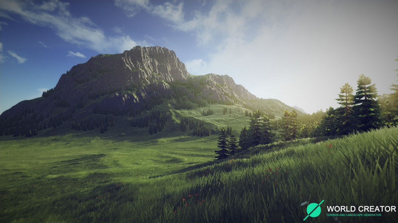

<!-- PROJECT LOGO -->
<br />
<p align="center">
  <a href="https://novout.github.io/worldcreator4noobs/">
    
  </a>
  <h3 align="center">Tutorial de World Creator 2</h3>
  <h3 align="center">Parceria entre He4rt Developers e Estúdio VacaRoxa</h3>
</p>

<!-- TABLE OF CONTENTS -->

## Conteúdo

<h1>
  
</h1>

- **Para não precisar rodar o projeto localmente, pode acessar diretamente por** [aqui](https://novout.github.io/worldcreator4noobs/)

<!-- ABOUT THE PROJECT -->

## Sobre o Projeto

Produzido com a colaboração de integrantes da **He4rt Developers**, esse tutorial tem como objetivo principal apresentar e ensinar a utilizar a ferramenta WC2 de uma maneira fácil, descomplicada e acessível para todos.

<!-- GETTING STARTED -->

## Iniciando

Para fazer uma cópia e rodar o projeto localmente, siga estes passos.

### Pré-requisitos

Os programas a seguir são necessários para estender, modificar e utilizar o projeto.

- [NodeJS](https://nodejs.org)
- [Yarn](https://yarnpkg.com)

### Instalação

1. Clone o repositorio

```sh
git clone https://github.com/Novout/worldcreator4noobs.git
```

2. Instale as dependências

```sh
yarn install
```

<!-- USAGE EXAMPLES -->

## Como Usar

Para iniciar o servidor de desenvolvimento utilize o seguinte comando

```sh
yarn dev
```

Para realizar a build do projeto execute o seguinte comando

```sh
yarn build
```

<!-- CONTRIBUTING -->

## Como Contribuir

Contribuições fazem com que a comunidade open source seja um lugar incrível para aprender, inspirar e criar. Todas contribuições
são **extremamente apreciadas**

1. Realize um Fork do projeto
2. Adicione o conteúdo (`git add -A`)
3. Crie um branch com a nova feature (`git checkout -b feature/featureBraba`)
4. Realize o Commit (`git commit -m 'adicionando conteudo brabo'`)
5. Realize o Push no Branch (`git push origin feature/featureBraba`)
6. Abra um Pull Request

<!-- LICENSE -->

## Licença

Distribuido sobre a licença `MIT`. Leia o arquivo `LICENSE` para mais informações.

<!-- CONTACT -->

## Desenvolvido por

Giovane Cardoso - [@NovoutT](https://twitter.com/NovoutT) - novout@hotmail.com
